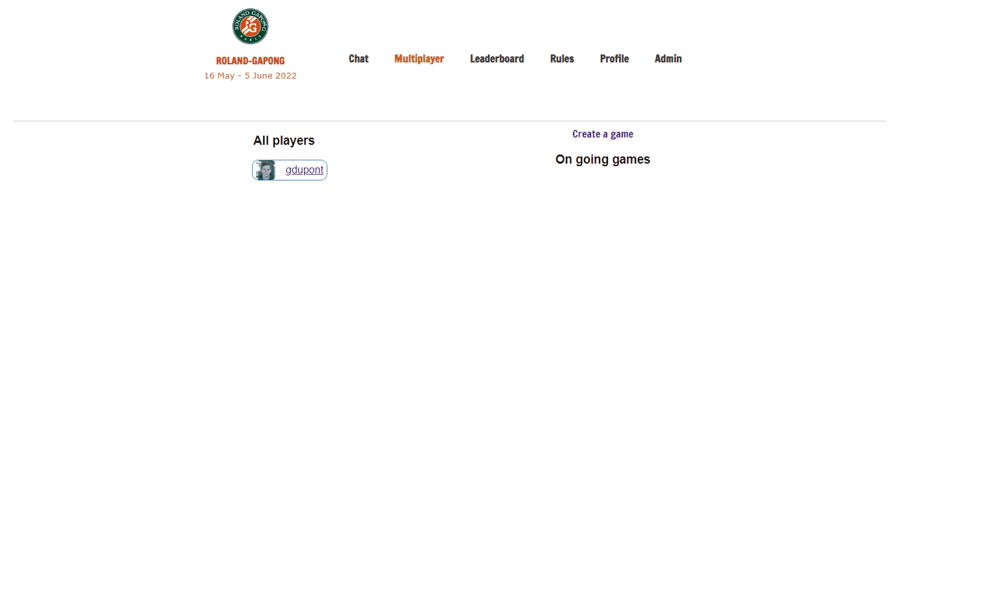

### Welcome to my ft_transcendence repository 👋

⭐️ The aim of this project is to build a website with a pong game, a chat system and an account system.<br>
The front-end is implemented in vue.js whereas the back-end is implemented with nestJS. The website is built with a PostgreSQL database.<br>

Gif incoming...<br>

<!-- <p align="center">
	
</p> -->

Made with [GuiDupont](https://github.com/GuiDupont) and [lmalki-h](https://github.com/lmalki-h/ft_transcendence).

## 💡 Usage

You need to have docker install on your system in order to run the docker-compose command.

```
docker-compose up --build
```
Then, in the browser, http://localhost:8080.<br>

⚠️ You need to have a 42 account in order to log in to the website.<br>
⚠️ Project realized for learning purposes, it may contain bad practices, do not use for professional purposes.

## 👷 Contributors
- [Guillaume Dupont](https://github.com/GuiDupont)
- [Louisa Malki Haegel](https://github.com/lmalki-h).